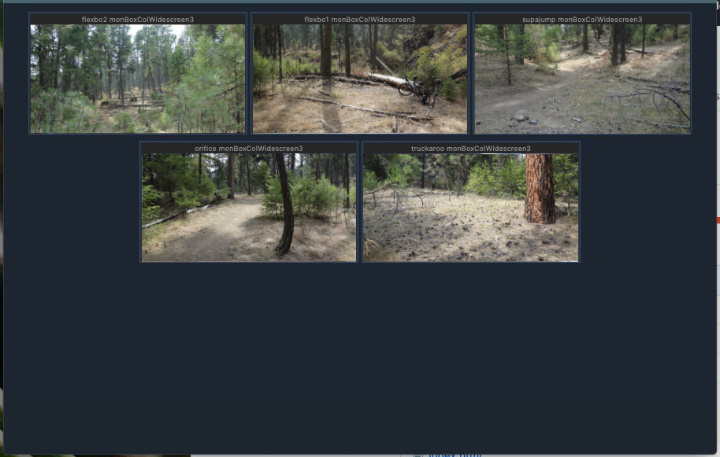

## ZM Camera Grid
### A simple single web page showing a grid of ZoneMinder cameras

---


I'll be adding more notes and configuration information soon.


---
## *** WARNING *** NOT FOR PUBLIC FACING WEB SERVERS!
(Unless you know exactly how you plan to secure access to this)
The reason you should NOT put this on a public facing web server is because this relies on access a config.local.json file, which anyone would be able to read if they know the URL. (more notes below)

THIS USES CREDENTIALS IN THE URI. ONLY USE THIS WITH SSL SETUP ON YOUR ZM SERVER!!
Once I add token auth with ZM this will be less of an issue, but I still recommend SSL.


---
## Why did I build this?

Because I wasn't happy with other solutions and figured "Heck, I could probably just build a simple SPA to view these cameras using ZoneMinder API!"  I just wanted a simple , reliable "camera wall" for a couple users to watch lots of the cameras. zmNinja is a fantastic tool, and you should probably stick to using that instead, but I wanted something a bit simpler and customized.  This is not meant for camera management, only simple viewing.

This is totally a work in progress!!  I have it running at home and work right now , testing how well it works.  I needed to hack something together quickly, so this has many issues, but it is working for me so far.

---
## Issues
-- The biggest issue I plan to handle differently, but at a later date, is the credential storage.  Curently this makes a connection to get config.local.json, which contains login information for ZoneMinder.  I plan to add token auth with ZM later.

-- This currently only works with Multi-port configured in ZoneMinder. I have not tested without it.

-- You need to configure your web server on ZoneMinder to support CORS requests. And you'll need to allow for this app and zmNinja or other apps. What I've done is added an extra config file in Apache for ZM, so when this hosts using a local Node.js web server, running on localhost:12380, Apache will allow access.  Here's an example of how I allow zmNinja as well. Add a .conf file in your apache conf.d folder with this: (name can be anything ending in .conf, example: zm-cors-headers.conf)
```
SetEnvIf Origin "http(s)?://(www\.)?(localhost:8080|localhost:12380)$" AccessControlAllowOrigin=$0
Header add Access-Control-Allow-Origin %{AccessControlAllowOrigin}e env=AccessControlAllowOrigin

Header always set Access-Control-Allow-Credentials true
Header always set Access-Control-Methods "OPTIONS,GET,POST,DELETE,PUT"
Header always set Access-Control-Allow-Headers "X-Requested-With, Content-Type, Authorization, Origin, Accept, client-security-token"
```

-- THIS USES CREDENTIALS IN THE URI. ONLY USE THIS WITH SSL SETUP ON YOUR ZM SERVER!!

-- If your cameras drop out or stall, its probably due to your server being overloaded. I have this running on 30 cameras just fine at work, but I know I have extra RAM, low CPU resource usage, H.264 passthrough and low frame rates, and also GPU accellerated. At home, I have 5 cameras, but occasionally I get a dropped camera on the grid. My home server does have low CPU usage and low disk usage, but it's running only 4G RAM and swap is being used. Plus I have slightly higher FPS on the cameras (about 12 I think).

-- I run CentOS - for some reason ZM setup the cgi-bin directory weird and I have to set its path to "/cgi-bin-zm". Just make sure you set your "cgiPath" correctly.

---
## Setup
(INCOMPLETE)

Requirements:
1. You must have multi-port working on ZoneMinder.
2. You really need to have SSL working on ZM too! (I suppose technically this would work without, but its a bad idea)
3. You must have the CORS config added to Apache if running on localhost Node.js http-server
4. I only tested with 1.34.x of ZoneMinder.


Clone the repo or copy the files to where you want to run this.  This needs to run on an HTTP server of some kind. Node.js works well on your local machine using the http-server npm package.  (an example of running the server is in the run-local-server.sh script.) Once http-server is running, open your browser to http://localhost:12380/

Create a config.local.json file next to index.html.  Just copy the help/example.config.json file to config.local.json and start adjusting the properties for your server.

Add your ZM Monitors (cameras) by *name* to the "monitors" array in config.

```
{
	"zmUser": "your-user",
	"zmPass": "your-pass",
	"hostUrl": "https://your-server-name",
	"apiPath": "/zm/api",
	"cgiPath": "/zm/cgi-bin",
	"multiPort": 30000,
	"pageReloadInterval": 900,
	"wallName": "My Camera Grid",
	"gridScale": 35,
	"showCaptions": false,
	"monitorsPerRow": 5,
	"gridRatio": "cif",
	"monitors": [
		"cam1"
		, "cam2"
		, "cam3"
		, "cam4"
		, "cam5"
	]
}
```

Lastly, open http http://localhost:12380/ in your browser. (Or point it to wherever you are serving/hosting the index.html and config files)

---
## Configuration Parameters
(just a few important notes for now)


### **multiPort**

- Not Required
- default: 30000
- values: *integer*
- The starting multi-port value used in ZoneMinder.

### **gridScale**

- Not Required
- default: 50
- values: *integer > 0*
- Sets the ZoneMinder API "scale" value of the video. On a small grid, use a larger scale. On a large grid, use a small value of maybe 25 or 30. This will show a lesser quality image in the grid but uses less bandwidth. When clicking to view single monitor, the single monitor view will use 100% scale.

### **gridRatio**

- Not Required
- default: standard
- values: standard, cif, widescreen
- Sets the grid view image cropping to a uniform size. Standard is 4x3, CIF is about 3x2, widescreen 21x9.

### **pageReloadInterval**

- Not Required
- default: 900
- values: *in seconds*
- Reloads the page at this interval.

### **monitors**

- Required
- default: *empty*
- Specify each monitor by name in a JSON array.

### **monitorsPerRow**

- Not Required
- default: 3
- values: *integer 1-9*
- Show monitors per each row in the grid.


## Troubleshooting
*soon*

## Tips
*soon*


